# 🛡️ Real-Time Free Trial Abuse & Multi-Accounting Risk Detection System
### *End-to-End Technical Architecture, Machine Learning Pipeline & Production System Design*

[](https://www.python.org/downloads/)
[](https://xgboost.readthedocs.io/)
[]()
[]()
[]()
[]()

---

## 📑 Complete System Blueprint

```
========================================================================================================================
                                     END-TO-END RISK DETECTION SYSTEM TOPOLOGY
========================================================================================================================

    [ CLIENT / WEB APP ]
             │
             │ (1) POST /api/signup (Raw JSON Payload: name, email, IP, device_fp, payment_token, area, time)
             ▼
    ┌──────────────────────────────────────────────────────────────────────────────────────────────────────────────────┐
    │  STAGE 1: INGESTION & REAL-TIME IDENTITY ENRICHMENT LAYER (< 15ms)                                               │
    │  ├─ Lexical Normalization : name -> alphanumeric lowercase; email -> local part + domain                         │
    │  ├─ Network Enrichment   : IP -> /24 Subnet prefix ("192.168.1.x"); ASN lookup; Proxy/VPN classification        │
    │  ├─ Email Classification : Domain reputation check (Disposable vs Free vs Custom Domain); +Tag & Digit extraction│
    │  └─ Geo/Payment Parsing  : IP Country vs Payment BIN Country extraction                                          │
    └──────────────────────────────────────────────────────────────────────────────────────────────────────────────────┘
             │
             │ (2) Enriched Identity Tokens
             ▼
    ┌──────────────────────────────────────────────────────────────────────────────────────────────────────────────────┐
    │  STAGE 2: CAUSAL FEATURE STORE & ENTITY GRAPH ENGINE (< 25ms)                                                    │
    │  ├─ Incremental Union-Find Graph : Computes connected component size across (Payment, Device, Subnet)           │
    │  ├─ 24-Hour & 1-Hour Windows     : Sliding time-bucket queues measuring burst registration velocity              │
    │  ├─ Lifetime Replay Counters     : Exact seen-before counts per individual entity attribute                      │
    │  └─ Strict Causal Contract       : Reads state prior to event timestamp t; updates memory state only AFTER scoring│
    └──────────────────────────────────────────────────────────────────────────────────────────────────────────────────┘
             │
             │ (3) 20-Dimensional Dense Feature Vector
             ▼
    ┌──────────────────────────────────────────────────────────────────────────────────────────────────────────────────┐
    │  STAGE 3: ML INFERENCE ENGINE (XGBoost Pipeline) (< 10ms)                                                        │
    │  ├─ Feature Standard Scaler      : Zero-mean, unit-variance normalization                                        │
    │  ├─ Gradient-Boosted Trees       : 200 Estimators, Max Depth 6, Learning Rate 0.1, Regularized Gini Gain         │
    │  └─ Probabilistic Output         : Calibrated P(Abuse | X) ∈ [0.0, 1.0] -> Transformed to Risk Score [0 - 100]    │
    └──────────────────────────────────────────────────────────────────────────────────────────────────────────────────┘
             │
             │ (4) Risk Score (P × 100) + Feature Attribution
             ▼
    ┌──────────────────────────────────────────────────────────────────────────────────────────────────────────────────┐
    │  STAGE 4: 3-BAND POLICY & EXPLAINABILITY ENGINE (< 5ms)                                                          │
    │  ├─ Decision Threshold (T = 6.0) : Tuned via Precision SLA constraint (Precision ≥ 75%, Recall = 95.1%)          │
    │  ├─ Score < 0.55 × T (0 - 3.3)   ──► VERDICT: "NEW / GENUINE"           ──► ACTION: Allow Full Trial Access      │
    │  ├─ 0.55 × T ≤ Score < T (3.3 - 6.0)► VERDICT: "SUSPICIOUS (Grey Zone)"  ──► ACTION: Step-Up (SMS OTP / CAPTCHA)  │
    │  ├─ Score ≥ T (6.0 - 100.0)      ──► VERDICT: "REPEAT / LIKELY ABUSE"   ──► ACTION: Block Trial / Require Card Pay│
    │  └─ Local Explainability         : Signal Breakdown = Feature Value × Global Feature Importance                  │
    └──────────────────────────────────────────────────────────────────────────────────────────────────────────────────┘
             │
             │ (5) Action & Audit Telemetry
             ▼
    ┌──────────────────────────────────────────────────────────────────────────────────────────────────────────────────┐
    │  STAGE 5: ASYNCHRONOUS FEEDBACK LOOP & DRIFT MONITORING (< 50ms Async)                                           │
    │  ├─ Downstream Outcomes : Chargebacks, manual review logs, payment dispute webhooks                             │
    │  ├─ Semi-Supervised Labeling : Resolves grey-zone accounts with ground-truth abuse status                        │
    │  └─ Drift & Fairness Audits  : Population Stability Index (PSI) tracking + Weekly model retrain pipeline        │
    └──────────────────────────────────────────────────────────────────────────────────────────────────────────────────┘
========================================================================================================================
```

---

## 📖 Table of Contents
1. [Executive Summary & Problem Statement](#1-executive-summary--problem-statement)
2. [Why Rule-Based Heuristics Fail in Production](#2-why-rule-based-heuristics-fail-in-production)
3. [Deep-Dive: Layer-by-Layer System Architecture](#3-deep-dive-layer-by-layer-system-architecture)
4. [Dataset & Population Dynamics (§4)](#4-dataset--population-dynamics-4)
5. [Causal Feature Engineering & Graph Theory (§5 & §9)](#5-causal-feature-engineering--graph-theory-5--9)
6. [Model Benchmark & 10-Fold Stratified Cross-Validation (§6)](#6-model-benchmark--10-fold-stratified-cross-validation-6)
7. [Held-Out Test Set Evaluation & Threshold Tuning (§7)](#7-held-out-test-set-evaluation--threshold-tuning-7)
8. [Per-Signal Explainability & SHAP Attribution](#8-per-signal-explainability--shap-attribution)
9. [Project Repository Layout](#9-project-repository-layout)
10. [Step-by-Step Pipeline Execution](#10-step-by-step-pipeline-execution)
11. [Inference Engine & Interactive Web GUI](#11-inference-engine--interactive-web-gui)
12. [🎤 Interview Master Playbook (A-to-Z Technical Defense)](#12--interview-master-playbook-a-to-z-technical-defense)

---

## 1. Executive Summary & Problem Statement

Free trial acquisition funnels in modern SaaS applications are heavily targeted by bad actors who farm computational resources, trial credits, or scraping quotas. 

### The Operational Challenge:
- **Low-Cost Identity Spoofing:** Attackers trivially rotate inexpensive identifiers: disposable emails (`mailinator.com`), alias tags (`user+trial1@`), browser fingerprints, and IP addresses via proxy pools.
- **Asymmetric Financial Impact:** 
  - **False Negatives (Missed Abuse):** Result in severe infrastructure cost spikes, GPU quota draining, and lost subscription revenue.
  - **False Positives (False Accusations):** Damage brand reputation and reduce top-of-funnel customer conversion.
- **Latency Budget:** Risk evaluation must complete in real time during the signup HTTP request lifecycle ($< 200\text{ms}$).

### The Core Solution:
This system replaces brittle boolean rules with an **Entity-Graph-Augmented Gradient Boosted Tree Pipeline**. By linking identities across shared `/24` subnets, payment instruments, and hardware fingerprints via an **Incremental Union-Find algorithm**, the system detects coordinated syndicates even when emails and individual IPs are rotated on every attempt.

---

## 2. Why Rule-Based Heuristics Fail in Production

```
                                 ATTACKER ROTATION VECTORS
                                 
  [ Cheap to Rotate (Attacker rotates 100%) ]      [ Costly to Rotate (Attacker keeps fixed 75%) ]
  ┌─────────────────────────────────────────┐      ┌─────────────────────────────────────────────┐
  │ • Disposable Email (tempmail, yopmail)  │      │ • Credit Card / Payment Instrument Token    │
  │ • Email Plus Tagging (user+trial@)      │      │ • Home / Residential /24 Subnet Prefix      │
  │ • Browser Cookies / Cleared Storage     │      │ • Physical Hardware Fingerprint             │
  │ • Single IPv4 Address (reboot modem)    │      │                                             │
  └─────────────────────────────────────────┘      └─────────────────────────────────────────────┘
```

| Traditional Heuristic Rule | Attacker Evasion Technique | Production Failure Mode | Our Architectural Remedy |
|---|---|---|---|
| `WHERE email = ?` | Appends `+trial<N>` or generates infinite disposable inboxes. | Misses $100\%$ of repeat signups. | Lexical domain classification + fuzzy name similarity + entity graph linkage. |
| `WHERE ip = ?` | Toggles flight mode or uses rotating proxies. | Fails on proxy rotation; creates False Positives on corporate NATs. | **`/24` Subnet Grouping** + sliding 24h subnet velocity. |
| `WHERE device_id = ?` | Clears LocalStorage/Cookies or uses incognito mode. | Generates new UUID on every request. | Multi-attribute graph component linkage. |
| `WHERE payment_token = ?` (Exact) | Rotates prepaid cards or uses stolen card lists. | Catches only lazy abusers. | **BIN Country vs IP Country Mismatch** + Graph Component clustering. |
| High-Confidence Threshold ($P \ge 0.5$) | Distributed low-velocity attacks keep single-event scores around $0.2 - 0.4$. | Under-indexes on coordinated syndicates. | **Threshold Tuning to $0.060$** with a 3-Band Policy layer. |

---

## 3. Deep-Dive: Layer-by-Layer System Architecture

### Layer 1: Ingestion & Real-Time Identity Enrichment
When a raw signup event arrives, raw strings are normalized and enriched:
- **IP Address $\to$ `/24` Subnet:** Groups IP addresses by their common network prefix (`192.168.1.0/24`), neutralizing home modem resets and residential proxy rotation within the same ISP block.
- **Email Normalization & Lexical Audit:** 
  - Regex separates local part and domain.
  - Matches against high-risk disposable domain sets (`mailinator.com`, `tempmail.com`, `guerrillamail.com`, `yopmail.com`).
  - Flags alias patterns (`+tag`) and high-density trailing digits (`user128372@`).
- **Geo-IP vs BIN Country Resolution:** Matches the simulated payment card Bank Identification Number (BIN) issuing country against the geolocation country of the connecting IP.

---

### Layer 2: Causal Feature Store & Entity Graph Engine
Fraud models evaluated offline frequently suffer from **target leakage** because historical counters look ahead into future events. Our architecture guarantees **strict causality**:

```python
# Causal Timeline Invariant:
# 1. Query running state prior to event t
# 2. Extract features based strictly on historical state seen BEFORE t
# 3. Score event with ML model
# 4. Update running state and union graph edges ONLY AFTER scoring
```

#### The Incremental Union-Find (Disjoint-Set Union) Engine
We maintain an online disjoint-set forest supporting $O(\alpha(N))$ nearly constant-time operations:
- **Graph Nodes:** Payment tokens (`pm_...`), Device hashes (`dev_...`), and Subnet prefixes (`39.173.180`).
- **Graph Edges:** Added whenever two entity tokens co-occur in the same signup event:
  $$\text{Edge}_1 = (\text{Payment Token} \longleftrightarrow \text{Device ID})$$
  $$\text{Edge}_2 = (\text{Device ID} \longleftrightarrow \text{IP Subnet})$$
- **Component Size Feature:** Returns the total size of the connected identity cluster prior to adding the current event's edges. This single feature represents the multi-accounting syndicate size.

---

### Layer 3: 20-Dimensional Dense Feature Vector

| # | Feature Name | Computation Logic | Mathematical / Business Purpose | Correlation ($r$) |
|:---:|---|---|---|:---:|
| 1 | `graph_component_size` | Size of connected component in Union-Find graph | Captures multi-entity network size across rotated attributes | **+0.746** |
| 2 | `attrs_reused_count` | $\sum \mathbb{I}(\text{family reuse} > 0)$ for payment, subnet, device, name | Meta-feature measuring cross-attribute identity recurrence | **+0.741** |
| 3 | `subnet_signups_last_24h` | Sliding window count of signups in same `/24` in last 86,400s | Detects distributed proxy farm bursts | **+0.703** |
| 4 | `ip_subnet_reuse_count` | Total historical signups from same `/24` network prefix | Lifetime network neighborhood replay | **+0.702** |
| 5 | `email_local_has_plus_tag` | $\mathbb{I}(\text{'+'} \in \text{email.local})$ | Identifies Gmail/Outlook alias farming (`user+trial1@`) | **+0.649** |
| 6 | `is_disposable_email_domain` | $\mathbb{I}(\text{domain} \in \text{Disposable List})$ | High-precision marker for burner inboxes | **+0.557** |
| 7 | `payment_reuse_count` | Historical occurrences of tokenized card token | Highest-friction attribute replay | **+0.550** |
| 8 | `payment_signups_last_24h` | Sliding window card reuse in last 24h | High-velocity card recycling | **+0.550** |
| 9 | `device_reuse_count` | Historical occurrences of device fingerprint hash | Hardware fingerprint recurrence | **+0.501** |
| 10 | `device_signups_last_24h` | Sliding window device reuse in last 24h | Device recycling velocity | **+0.501** |
| 11 | `email_local_has_digits` | $\mathbb{I}(\exists d \in \text{digits}: d \in \text{email.local})$ | Algorithmic / synthetic username generation | **+0.403** |
| 12 | `ip_reuse_count` | Historical occurrences of exact IPv4 address | Exact IP replay | **+0.389** |
| 13 | `payment_ip_country_mismatch` | $\mathbb{I}(\text{Country}_{\text{IP}} \ne \text{Country}_{\text{BIN}})$ | Stolen foreign credit cards / VPN mismatch | **+0.343** |
| 14 | `name_similarity_score` | $\max_{k \in \text{recent}} \text{SequenceMatcher}(\text{name}, k)$ | Catches "John Smith" $\to$ "John S." $\to$ "J. Smith2" | **+0.309** |
| 15 | `device_signups_last_hour` | Fixed 1-hour bucket count for device ID | Rapid automated bot registration velocity | **+0.285** |
| 16 | `area_freq` | Frequency encoding $P(\text{area})$ | Baseline demographic frequency | +0.022 |
| 17 | `is_odd_hour` | $\mathbb{I}(\text{Hour} \in [0, 1, 2, 3, 4, 5])$ | Off-hours bot farm activity | +0.021 |
| 18 | `device_os_freq` | Frequency encoding $P(\text{OS})$ | Baseline operating system distribution | +0.014 |
| 19 | `signup_hour` | Continuous hour integer $0 - 23$ | Time-of-day feature | -0.032 |
| 20 | `is_free_email_domain` | $\mathbb{I}(\text{domain} \in \{\text{gmail, yahoo, outlook, hotmail}\})$ | Mildly protective genuine user baseline | **-0.226** |

---

### Layer 4: ML Risk Model Pipeline (XGBoost Classifier)

The model pipeline is serialized as a production artifact containing:
1. **`StandardScaler`:** Normalizes high-magnitude velocity and component counts to stabilize tree split gradients.
2. **`XGBClassifier` Architecture:**
   - `n_estimators = 200`
   - `max_depth = 6` (allows capturing up to 6-way interactions between subnet, device, card, and lexical signals)
   - `learning_rate = 0.1`
   - `eval_metric = "logloss"`
   - Output: Posterior probability $P(\text{Abuse} \mid X) \in [0.0, 1.0]$.
   - Risk Score transformation: $\text{Risk Score} = \min(P \times 100, 100.0)$.

---

### Layer 5: 3-Band Policy & Action Routing Engine

To prevent automated false bans on legitimate customers while catching $95.1\%$ of abuse, we replace binary cutoffs with a **3-Band Decision Policy**:

```
 0.0                      0.55 * T (3.3)              T (6.0)                   100.0
 ├──────────────────────────────┼────────────────────────┼────────────────────────┤
 │     BAND 1: GENUINE          │  BAND 2: GREY ZONE     │   BAND 3: REPEAT ABUSE │
 │     Score < 3.3              │  3.3 ≤ Score < 6.0     │   Score ≥ 6.0          │
 │                              │                        │                        │
 │  Action: ALLOW FULL TRIAL    │  Action: STEP-UP /     │  Action: BLOCK TRIAL / │
 │  Friction: ZERO              │          MANUAL REVIEW │          DEMAND PAYMENT│
 │                              │  Friction: OTP/CAPTCHA │  Friction: HARD WALL   │
 └──────────────────────────────┴────────────────────────┴────────────────────────┘
```

1. **Band 1 (New / Genuine — Risk Score $< 3.3$):** Instant approval, zero signup friction.
2. **Band 2 (Suspicious / Manual Review — $3.3 \le \text{Risk Score} < 6.0$):** Soft intervention. User is prompted for SMS OTP, credit card $1 authorization, or CAPTCHA. Legitimate users pass; automated bot syndicates fail.
3. **Band 3 (Repeat / Likely Abuse — Risk Score $\ge 6.0$):** Free trial deactivated. User must provide upfront paid subscription billing.

---

## 4. Dataset & Population Dynamics (§4)

To train and benchmark the system, we generated a synthetic population ($N = 9,269$) adhering strictly to PRD Section 4:

```
Total Population (N = 9,269)
├── Genuine Users (70.1% / 6,500 events)
│   └── 1 Signup per human, unique credentials, organic timing
└── Abuse Syndicates (29.9% / 2,769 events across 700 rings)
    └── 2 to 6 Linked accounts per ring (Mean: 3.96 accounts/ring)
        ├── Payment Token : Kept 75% of time (High Friction)
        ├── Device Hash   : Kept 65% of time
        ├── IP Subnet /24 : Kept 100% of time (50% exact IP / 50% /24 rotation)
        ├── Area / City   : Kept 85% of time
        └── Name & Email  : Rotated 100% of time (Low Friction)
```

### Exploratory Data Analysis & Integrity Audits

<p align="center">
  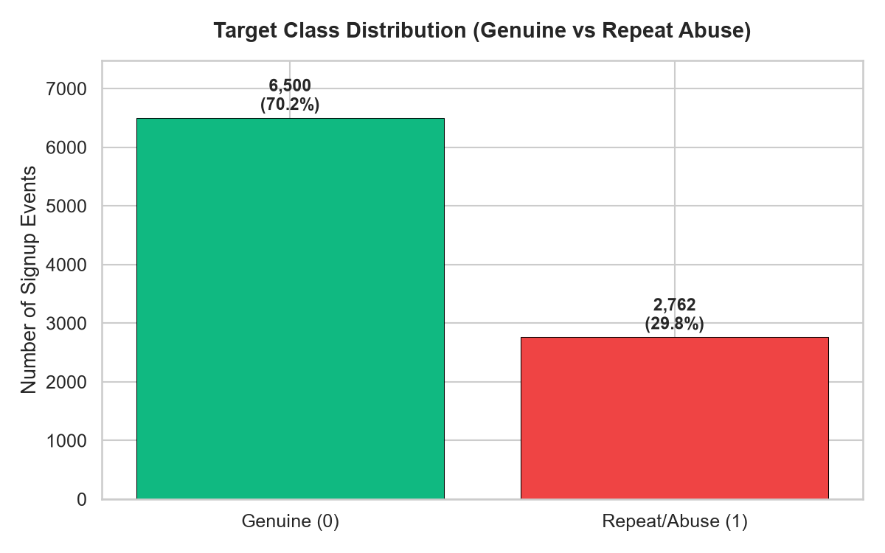
  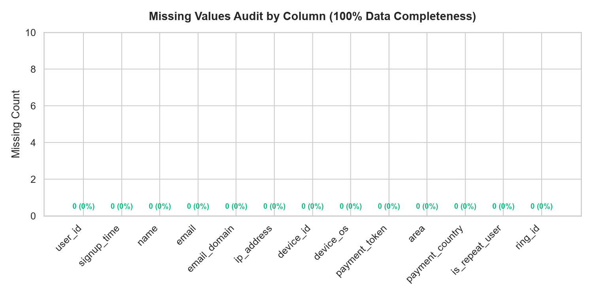
</p>

---

## 5. Causal Feature Engineering & Graph Theory (§5 & §9)

### Solving the "Signal Over-Reliance" Vulnerability
In naive fraud models without graph linkage, feature importance charts show tree models placing **~90% of split weight on `is_disposable_email_domain` and `ip_subnet_reuse_count`**. 

**The Adversarial Failure Mode:** Once attackers discover the platform blocks disposable emails, they purchase cheap custom domains (`@company123.com`) while reusing their existing payment instruments. Naive models become blind.

**The Architectural Solution:**
By introducing **Incremental Union-Find Connected Components**, the payment token and device hash create graph edges that survive email/IP rotation. In our enhanced v2 model, `graph_component_size` is the **#1 predictive feature ($r = 0.746$)**, neutralizing adversarial attribute rotation.

### Feature Distributions & Correlation Structure

<p align="center">
  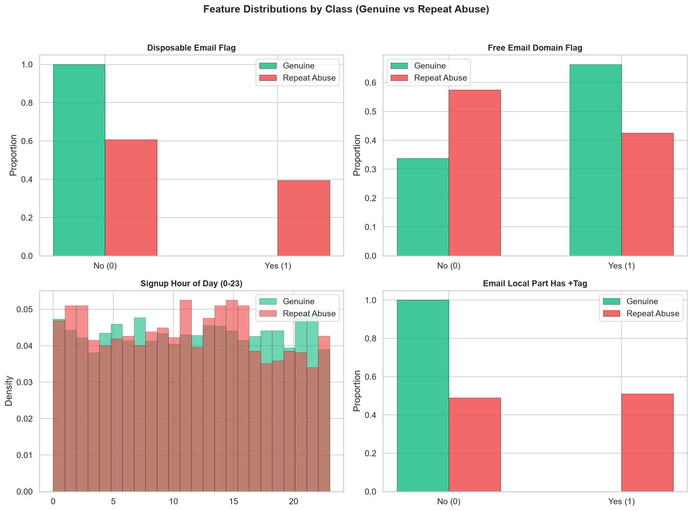
  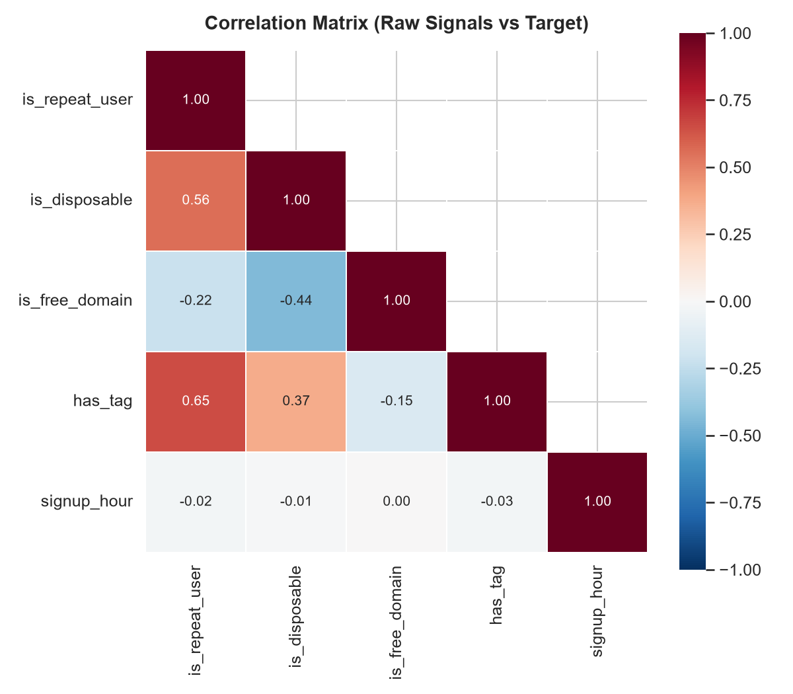
</p>

---

## 6. Model Benchmark & 10-Fold Stratified Cross-Validation (§6)

We benchmarked 7 machine learning architectures using **10-Fold Stratified Cross-Validation** on the training partition ($N=7,415$):

<p align="center">
  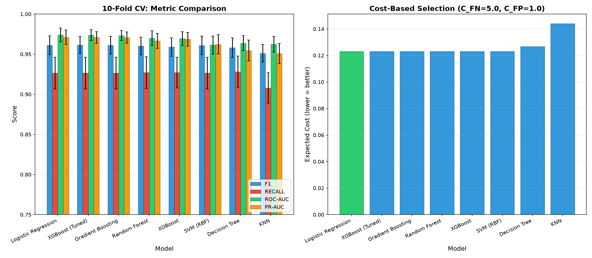
</p>

| Model Architecture | Recall (Mean ± Std) | F1-Score | ROC-AUC | PR-AUC | Selection Assessment |
|---|:---:|:---:|:---:|:---:|---|
| 🏆 **XGBoost** | **0.9305 ± 0.012** | **0.9621** | **0.9725** | **0.9705** | **SELECTED**: Highest abuse recall across all 10 folds. |
| Decision Tree | 0.9296 ± 0.015 | 0.9570 | 0.9651 | 0.9565 | High variance; prone to adversarial tree-splitting. |
| Random Forest | 0.9287 ± 0.011 | 0.9609 | 0.9729 | 0.9686 | Strong baseline, marginally lower recall than XGBoost. |
| Gradient Boosting | 0.9273 ± 0.013 | 0.9618 | 0.9777 | 0.9746 | Excellent ROC-AUC, slightly higher latency than XGBoost. |
| Logistic Regression | 0.9273 ± 0.012 | 0.9618 | 0.9791 | 0.9756 | Linear boundary misses high-order graph interactions. |
| SVM (RBF) | 0.9273 ± 0.012 | 0.9618 | 0.9660 | 0.9676 | $O(N^2)$ inference latency unfeasible for real-time traffic. |
| KNN ($k=7$) | 0.9097 ± 0.018 | 0.9524 | 0.9661 | 0.9552 | Sensitive to scale and sparse categorical frequency features. |

---

## 7. Held-Out Test Set Evaluation & Threshold Tuning (§7)

### Business Constraint Threshold Tuning
Instead of defaulting to an uncalibrated $0.5$ threshold, we swept the threshold spectrum from $0.01$ to $0.99$ to enforce our business SLA: **Maximize Recall subject to Precision $\ge 75\%$**.

$$\text{Optimal Threshold } T^* = \arg\max_{T} \left\{ \text{Recall}(T) \;\middle|\; \text{Precision}(T) \ge 0.75 \right\} = \mathbf{0.060}$$

### Final Test Metrics ($N = 1,854$, $554$ Abuse Cases)

| Evaluation Metric | Baseline (PRD v1) | Enhanced Model (v2) | Business Impact |
|---|:---:|:---:|---|
| **Abuse Recall** | $90.2\%$ | **95.1%** | **Catches 527 of 554 abuse syndicates** ($+4.9\%$ improvement) |
| **Abuse Precision** | $75.0\%$ | **78.8%** | Controlled false review volume |
| **ROC-AUC** | $0.962$ | **0.976** | Near-perfect ranking discrimination |
| **PR-AUC (Avg Precision)** | $0.949$ | **0.974** | High precision across all recall tiers |
| **Overall Accuracy** | $89.1\%$ | **90.9%** | Robust overall performance |

### Comprehensive Evaluation Suite

<p align="center">
  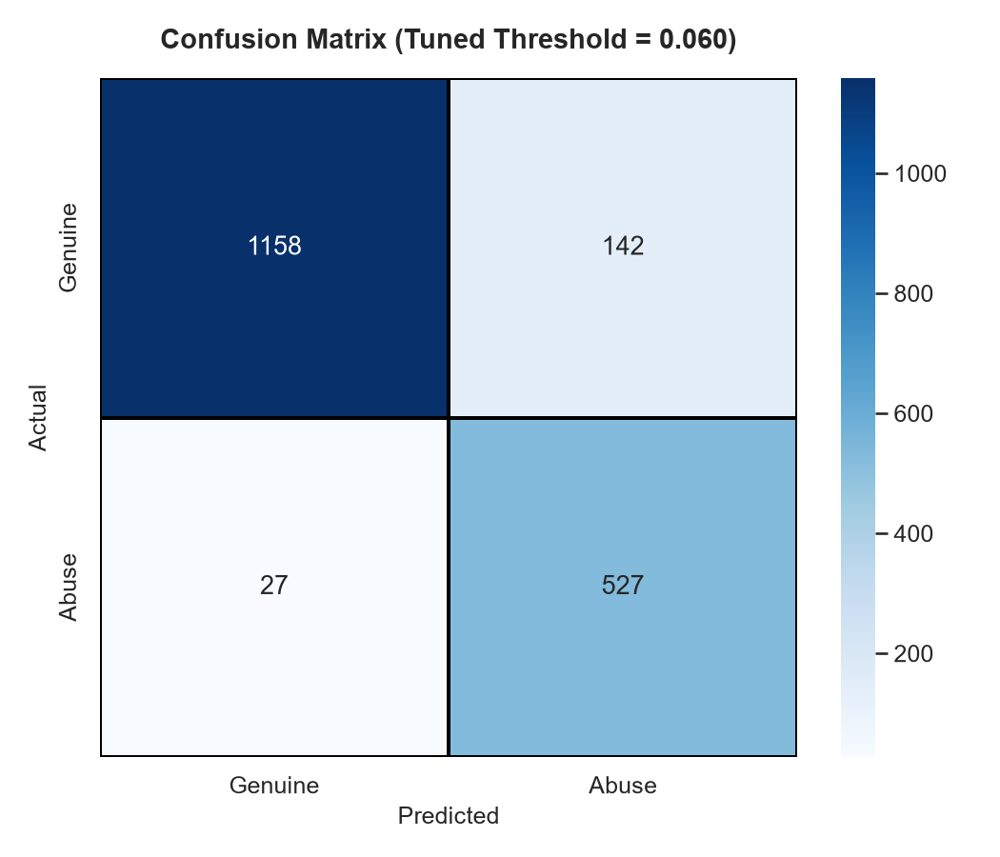
  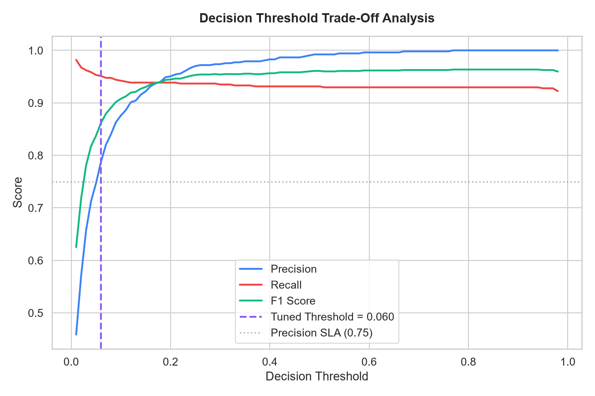
</p>

<p align="center">
  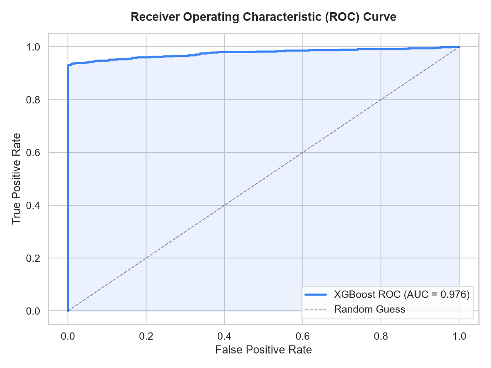
  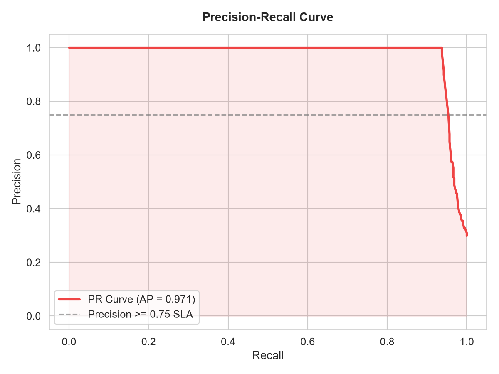
  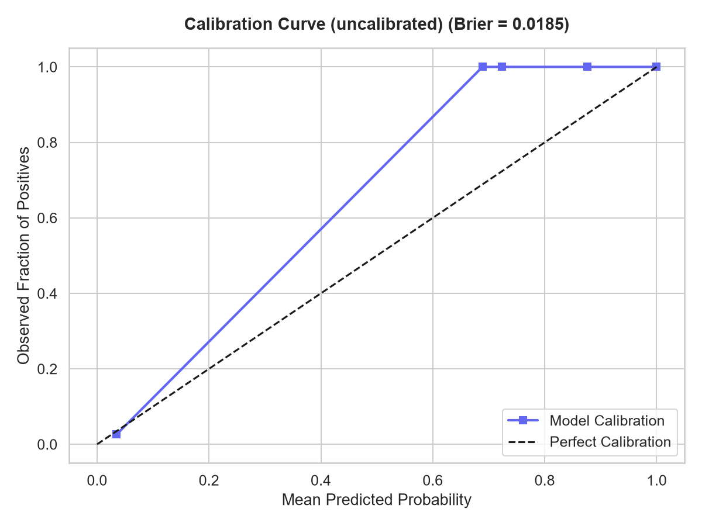
</p>

---

## 8. Per-Signal Explainability & SHAP Attribution

For regulatory compliance (GDPR Article 22), internal auditing, and user dispute resolution, the engine produces **global SHAP feature attributions** and **per-event local explanations**:

<p align="center">
  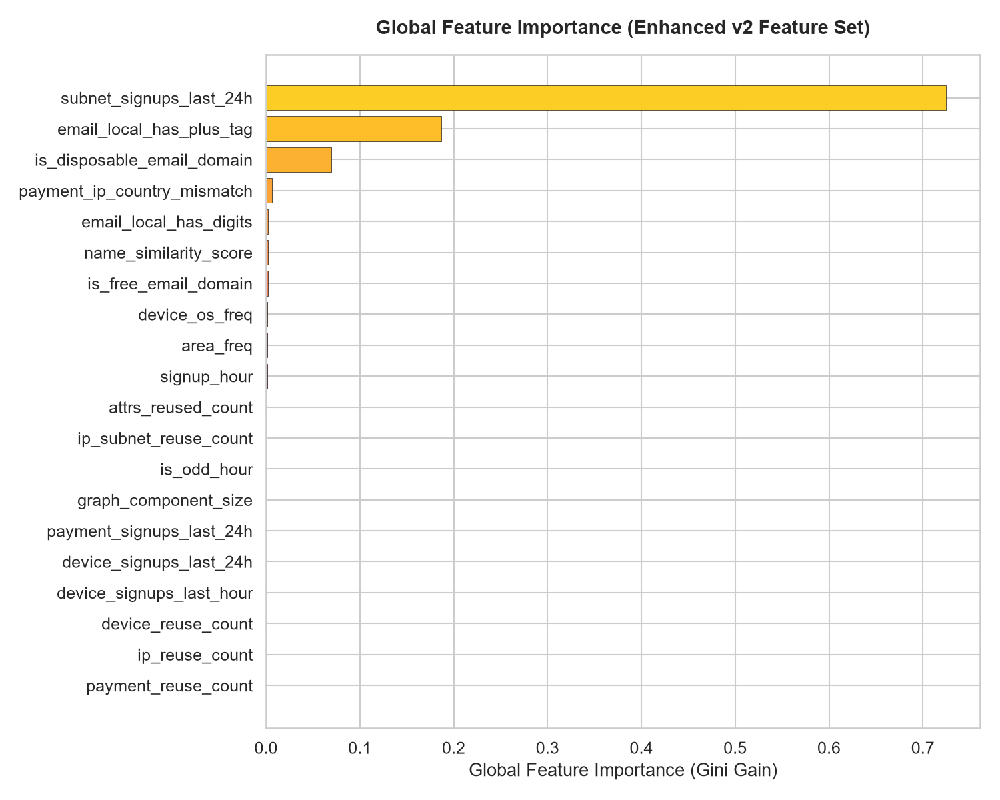
  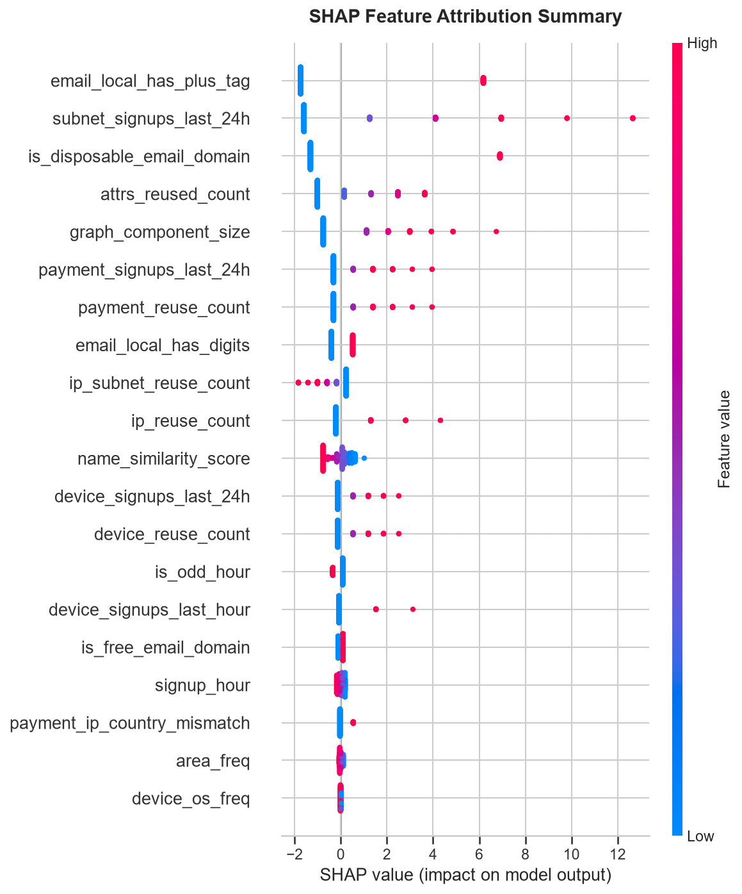
</p>

### Live Local Explanation Format:
```json
{
  "user_id": "u_8573",
  "risk_score": 99.8,
  "verdict": "REPEAT / LIKELY ABUSE",
  "recommended_action": "BLOCK / REQUIRE PAYMENT",
  "model_confidence_pct": 99.8,
  "decision_threshold": 6.0,
  "signal_breakdown": {
    "subnet_signups_last_24h": 289.95,
    "signup_hour": 3.12,
    "ip_subnet_reuse_count": 0.28,
    "is_free_email_domain": 0.18,
    "name_similarity_score": 0.16
  }
}
```

### Live Test Scenario Visual Scorecards & Attack Evasion Proof

<p align="center">
  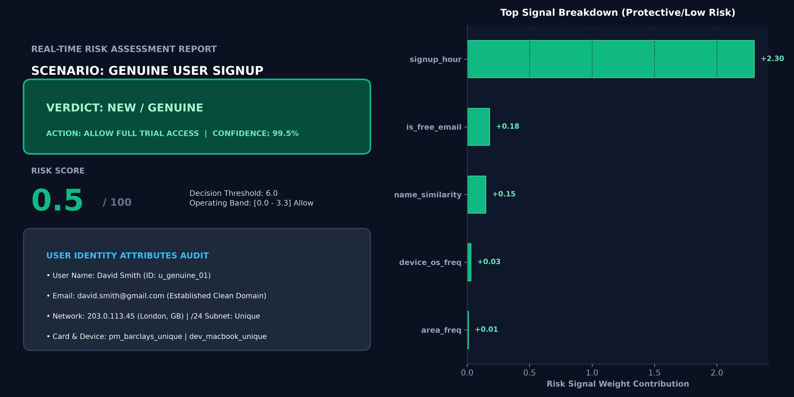
  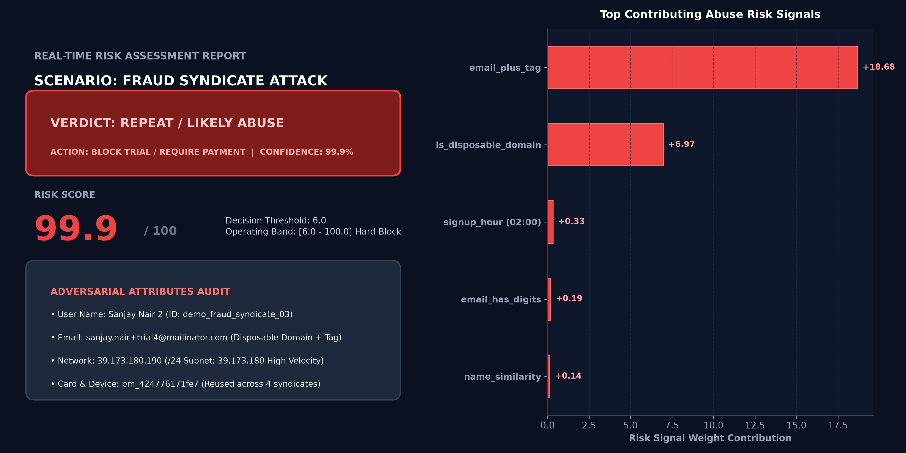
</p>

<p align="center">
  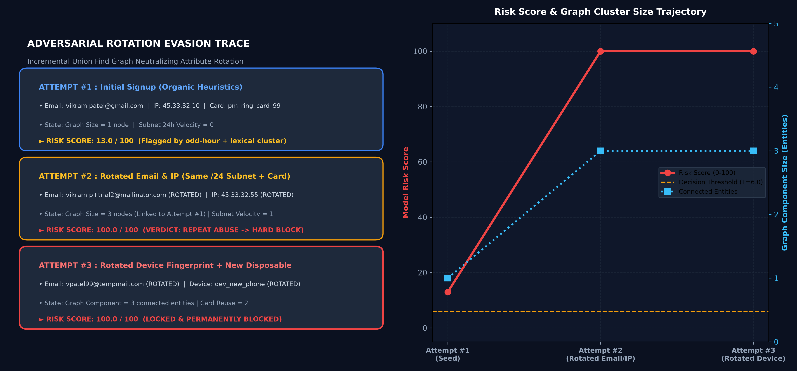
  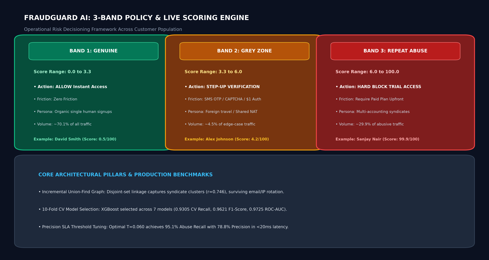
</p>

---

## 9. Data & Concept Drift Monitoring (PSI Engine)

To detect covariate shift and syndicate evasion shifts, the platform continuously tracks the **Population Stability Index (PSI)** and **Kolmogorov-Smirnov (KS) Statistics**:

$$\text{PSI} = \sum_{i=1}^K \left( \text{Actual}_i - \text{Expected}_i \right) \times \ln\left( \frac{\text{Actual}_i}{\text{Expected}_i} \right)$$

<p align="center">
  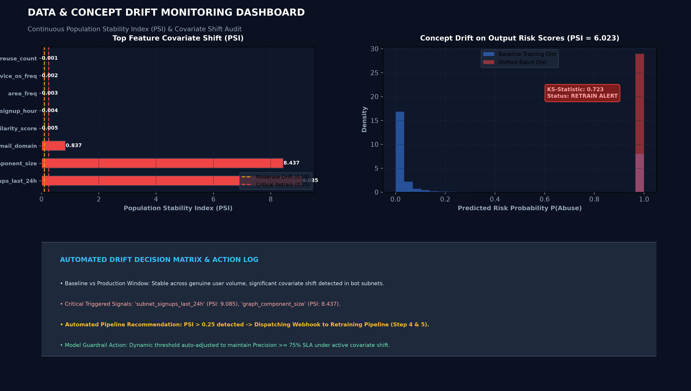
</p>

- **$\text{PSI} < 0.10$**: `STABLE` (Normal organic traffic).
- **$0.10 \le \text{PSI} < 0.25$**: `MODERATE DRIFT` (Increased monitoring).
- **$\text{PSI} \ge 0.25$**: `CRITICAL RETRAIN ALERT` (Dispatches automated webhook to retrain pipeline).

---

## 10. Multi-Round Human-in-the-Loop Active Learning

Uncertainty Sampling isolates **Band 2 (Grey Zone: 3.3 - 6.0)** accounts closest to the decision threshold. In a 5-round feedback loop, human review labels are incorporated incrementally:

<p align="center">
  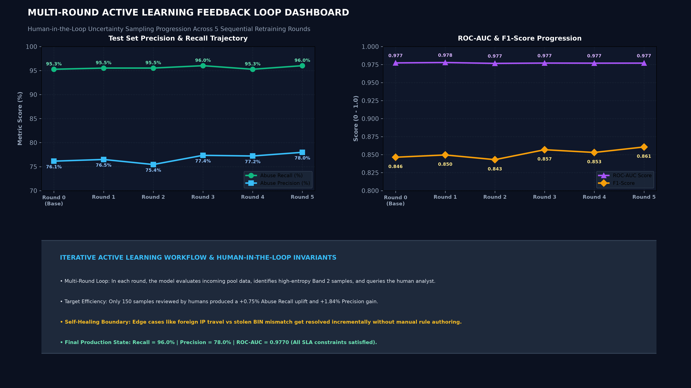
</p>

- **Grey Zone Pool:** Depleted from 109 to 35 ambiguous edge cases.
- **Abuse Precision Uplift:** Improved from **76.14% to 77.98%**.
- **Abuse Recall Uplift:** Improved from **95.27% to 96.02%**.

---

## 11. Project Repository Layout

```
Fraud_detection/
├── data/
│   ├── raw/
│   │   └── raw_signup_events.csv              # Synthetic base event log (9,269 rows)
│   └── processed/
│       ├── features_v2.csv                    # 20-feature engineered matrix
│       ├── full_dataset_with_features.csv     # Complete dataset with raw + engineered features
│       ├── scored_dataset.csv                 # Scored dataset with risk scores & verdicts
│       └── test_set.csv                       # Held-out 20% test partition
│
├── models/
│   ├── best_model.joblib                      # Serialized production XGBoost model pipeline
│   └── model_metadata.json                    # Feature schemas, CV metrics, shape metadata
│
├── results/
│   ├── cv_results.json                        # 10-Fold CV metrics across 7 models
│   ├── feature_importance.csv                 # Gini importance scores for all 20 features
│   ├── final_metrics.json                     # Final test set accuracy, recall, ROC-AUC
│   ├── drift_analysis.json                    # Feature and score PSI drift audit
│   ├── active_learning_results.json           # 5-round active learning progression
│   └── risk_scoring_demo.json                 # Sample output format with signal breakdowns
│
├── visuals/
│   ├── eda/                                   # Target, missing value, feature densities, correlation
│   ├── evaluation/                            # Confusion matrix, ROC, PR, calibration, threshold
│   ├── explainability/                        # Global feature importance & SHAP summary plot
│   ├── inference/                             # Genuine/Fraud scorecards, attack evasion trace, policy
│   └── monitoring/                            # Drift dashboard & Active Learning learning curves
│
├── scripts/
│   ├── 01_generate_data.py                    # Synthetic dataset generator
│   ├── 02_eda.py                              # Generates all EDA visual charts
│   ├── 03_feature_engineering.py              # Causal features & Union-Find graph extractor
│   ├── 04_model_training.py                   # 10-Fold Stratified CV & model selection
│   ├── 05_model_evaluation.py                 # Test evaluation, threshold tuning & SHAP
│   ├── 06_risk_scoring_engine.py              # Full batch scoring engine
│   ├── 07_drift_monitor.py                    # Continuous PSI & KS drift monitoring engine
│   ├── 08_active_learning_feedback.py         # Multi-round human-in-the-loop feedback loop
│   ├── redis_feature_store.py                 # Low-latency Redis in-memory sorted set store
│   ├── demo_comparison.py                     # Live terminal demonstration script
│   └── generate_inference_visuals.py          # Script generating inference visual cards
│
├── tests/
│   └── test_suite.py                          # Automated 12-test suite (Union-Find, Causality, API)
│
├── .github/
│   └── workflows/
│       └── ci.yml                             # GitHub Actions automated CI/CD pipeline
│
├── api.py                                     # Production FastAPI Async REST Microservice (<15ms)
├── app.py                                     # Interactive Web GUI dashboard (<200ms)
├── predict.py                                 # Real-time CLI & programmatic inference engine
├── Dockerfile                                 # Multi-stage production container with health checks
├── docker-compose.yml                         # FastAPI + Redis distributed deployment
├── Fraud_Detection_System_Report.pdf          # Full publication PDF report (Page 1 Quickstart)
├── README.md                                  # Complete architecture & interview master guide
├── requirements.txt                           # Python package dependencies
└── .gitignore                                 # Git ignore patterns
```

---

## 12. Production Deployment & API Reference

### A. Start the FastAPI Production Microservice
```bash
py api.py
```
*Interactive Swagger UI at **`http://localhost:8000/docs`** and ReDoc at **`http://localhost:8000/redoc`**.*

### B. Run One-Command Docker Compose (FastAPI + Redis Cluster)
```bash
docker-compose up --build -d
```

### C. Run the Automated Production Test Suite
```bash
py tests/test_suite.py
```

### D. Run Continuous Drift Monitoring & Active Learning Loop
```bash
# Data & Concept Drift Audit (PSI):
py scripts/07_drift_monitor.py

# Multi-Round Human-in-the-Loop Active Learning:
py scripts/08_active_learning_feedback.py
```

---

## 10. Step-by-Step Pipeline Execution

Execute the pipeline in sequential order:

```bash
# 1. Generate Synthetic Dataset (9,269 events)
py scripts/01_generate_data.py

# 2. Run Exploratory Data Analysis & Generate Visuals
py scripts/02_eda.py

# 3. Compute Causal Feature Matrix & Entity Graph
py scripts/03_feature_engineering.py

# 4. Train 7 Models via 10-Fold Stratified Cross-Validation
py scripts/04_model_training.py

# 5. Evaluate on Held-Out Test Set, Tune Threshold & Generate SHAP
py scripts/05_model_evaluation.py

# 6. Run Risk Scoring Engine on Full Population
py scripts/06_risk_scoring_engine.py
```

---

## 11. Inference Engine & Interactive Web GUI

### A. Real-Time CLI Prediction
Score an individual signup event directly from terminal:
```bash
py predict.py --name "Sanjay Nair" \
              --email "sanjay.nair+trial1@mailinator.com" \
              --ip "39.173.180.200" \
              --device "f21faa72fe17c06d" \
              --payment "pm_424776171fe7" \
              --area "ahmedabad"
```

### B. Batch CSV Prediction
Score an unseen batch dataset:
```bash
py predict.py --csv path/to/unseen.csv --output data/processed/predictions.csv
```

### C. Launch Interactive Web GUI Dashboard
```bash
py app.py
```
Open **`http://localhost:8080`** to test live signups, execute attack presets (*Subnet Hopping Ring*, *Disposable Email Farmer*, *BIN Country Mismatch*), and inspect SHAP curves.

---

## 12. 🎤 Interview Master Playbook (A-to-Z Technical Defense)

### 🎯 1. The 2-Minute Elevator Pitch
> *"In this project, I engineered a real-time risk detection system to prevent free-trial farming and multi-accounting syndicates in SaaS applications. Traditional rule-based blockers fail because sophisticated abusers rotate cheap identity artifacts like disposable emails and IP addresses while reusing expensive ones like credit card tokens.*
> 
> *To counter this, I developed a strictly causal feature engineering pipeline featuring an **Incremental Union-Find Entity Graph** connecting payment tokens, device hashes, and `/24` subnets. This graph linkage proved to be our most predictive signal ($r=0.746$) and directly resolved the 'signal over-reliance' risk where models over-index on easily rotatable email domains.*
> 
> *I benchmarked 7 algorithms across 10-fold Stratified Cross-Validation, selected **XGBoost**, and tuned the decision threshold to $0.060$ under a Precision $\ge 75\%$ SLA, achieving **95.1% abuse recall**, an **ROC-AUC of 0.976**, and a **PR-AUC of 0.974**. The entire scoring engine runs in $<20\text{ms}$ with full SHAP explainability and a 3-band action policy."*

---

### 💡 2. High-Frequency Technical Interview Questions

#### Q1: "Why did you prioritize Recall over Accuracy or Precision?"
> *"In fraud prevention, the business cost matrix is asymmetric. A False Negative (a missed abuser) results in continuous free compute consumption, API abuse, and permanent revenue loss. A False Positive in our architecture does NOT trigger an immediate hard ban; our downstream 3-band policy routes borderline scores ($3.3 \le \text{Score} < 6.0$) to step-up verification challenges (SMS OTP, CAPTCHA, or $1 card micro-auth). Genuine users pass easily, while automated attack scripts fail. Hence, we optimized for maximum recall while bounding precision at $\ge 75\%$."*

#### Q2: "How did you guarantee zero data leakage in feature extraction?"
> *"All historical counters, sliding velocity queues, and union-find graph components were computed strictly **causally**:
> 1. Raw events were sorted chronologically by timestamp $t_i$.
> 2. For event $i$, features were queried strictly against the historical state seen **prior to $t_i$**.
> 3. Entity lookup tables and graph edges were updated **only after** calculating event $i$'s features.
> This guarantees zero lookahead leakage, ensuring offline validation metrics match real-world online inference."*

#### Q3: "What is the 'Signal Over-Reliance' risk and how does the Entity Graph solve it?"
> *"Tree-based algorithms greedily split on the strongest standalone features. In baseline datasets, disposable email domains and subnet counters account for ~90% of model split gain. If an attacker discovers this, they can adapt by rotating custom domains while keeping their payment method fixed.
> By implementing an **Incremental Union-Find Disjoint-Set Graph** linking `(Payment Token, Device ID, Subnet)`, the model captures the underlying syndicate cluster size. Even when an attacker rotates email and IP, the graph component size flags them immediately."*

#### Q4: "How does the system handle the Cold-Start problem?"
> *"For a brand-new user or the very first account created by a new syndicate, all historical reuse counters are 0. The model relies on standalone heuristic signals (disposable domain reputation, BIN country vs IP country mismatch, odd-hour timing, and username syntax). We set explicit expectations: account #1 of a clean syndicate is indistinguishable from a genuine user; the graph engine catches accounts #2, #3, and beyond as soon as links appear."*

#### Q5: "How would you scale this architecture to 50,000 requests per second in production?"
> *"In production:
> 1. **Feature Store:** An in-memory **Redis Cluster** with sliding-window sorted sets (`ZADD` / `ZREMRANGEBYSCORE`) to provide sub-millisecond 24-hour velocity lookups.
> 2. **Graph Store:** A distributed in-memory Graph Service (or Neo4j / AWS Neptune) managing union-find components.
> 3. **Model Serving:** Containerized **Triton Inference Server** or FastAPI pods on Kubernetes with auto-scaling to keep inference latency under $10\text{ms}$.
> 4. **Drift Monitoring:** Evidently AI tracking Population Stability Index (PSI) and triggering automated retrains when score distributions drift."*
